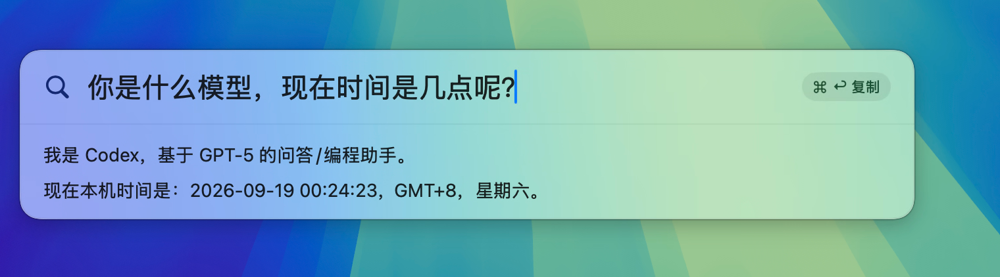

<div align="center">


# kearch

常驻菜单栏的 Spotlight 式 AI 搜索工具(macOS · Swift)

</div>

一键唤起迷你搜索框,输入问题回车,AI 回答流式展开为 Markdown。窗口失焦即关、不留历史,像 Spotlight 一样即用即走。



## 特性

- 🔍 **Spotlight 观感**:无边框毛玻璃面板,顶部居中,回车后向下展开结果
- ⌨️ **两种唤起**:点击菜单栏图标,或全局快捷键 **⌥Space**
- 🌊 **流式回答** + 精简 Markdown 渲染(标题 / 列表 / 代码块 / 行内样式)
- 📋 **⌘↩ 复制**:按住 ⌘ 显示提示,⌘↩ 把回答纯文本拷到剪贴板
- 🧹 **无历史**:ESC 或失焦即关,下次唤起是全新会话
- 🔑 **复用 Codex 凭证**:自动读取 `~/.codex/auth.json` 与 `config.toml`
- ⚙️ **可配置**:Base URL / Model / API Key / reasoning effort / 预设系统提示词 / 快捷键开关
- 🀄 **中文输入法友好**:拼音合成中的回车/ESC 交给输入法,不误触发

## 构建 / 运行

```bash
./icon/make-icons.sh   # 首次:生成 App 图标 icon/AppIcon.icns(需要 Xcode 命令行工具)
./build.sh             # swift build -c release + 组装 Kearch.app
open Kearch.app
```

调试:`swift run`(直接跑可执行,无 .app bundle 的菜单栏/图标行为)。

## 交互

| 操作 | 行为 |
|---|---|
| 点击菜单栏图标 / ⌥Space | 唤起 / 关闭搜索框 |
| 输入 + 回车 | 提问,结果区向下展开并流式渲染 |
| 按住 ⌘ | 显示 `⌘↩ 复制` 提示 |
| ⌘↩ | 复制回答纯文本到剪贴板 |
| ⌘A / ⌘C / ⌘V / ⌘X / ⌘Z | 输入框内标准编辑 |
| ESC / 点击别处失焦 | 关闭窗口(不保存历史) |
| 右键菜单栏图标 | 设置 / 关于 / 退出 |

## 配置来源(优先级:设置覆盖 > Codex)

| 项 | 来源 |
|---|---|
| API Key | `~/.codex/auth.json` 的 `OPENAI_API_KEY` |
| endpoint / model | `~/.codex/config.toml` 的 `model_providers.<provider>.base_url` 与 `model` |
| 协议 | OpenAI **Responses API**(`POST {base_url}/responses`,SSE 流式) |

设置窗口可覆盖上述项,并配置 **预设系统提示词**(每次请求附加在内置提示之后)与 ⌥Space 开关。

> 该 endpoint 若是 codex agent 后端,会倾向输出 `{"cmd": ...}` 工具调用。kearch 会注入本机时间、要求直答,并在客户端剥离残留的工具调用 JSON。

## 发布 / 自动更新

- 打 `v*` tag(如 `v0.1.0`)推送后,GitHub Actions 自动构建 `Kearch.app`、打包 DMG 并创建 Release。
- App 内「设置 → 关于」可**检查更新**并一键下载安装(下载 DMG → 覆盖当前 .app → 重启),数据源为本仓库的 GitHub Releases。

```bash
git tag v0.1.0 && git push origin v0.1.0   # 触发发布
```

## 结构

```
Sources/Kearch/
├── KearchApp.swift            # @main 入口(.accessory)
├── AppDelegate.swift          # 主菜单(编辑快捷键)、设置/关于窗口、热键装配
├── StatusBarController.swift  # 菜单栏图标 + 左键唤起 / 右键菜单
├── MenuBarIcon.swift          # 程序化绘制的扁平模板图标
├── GlobalHotKey.swift         # Carbon 全局 ⌥Space
├── Panel/                     # 无边框面板 + 显隐/定位/事件(ESC/⌘/回车/失焦/输入法)
├── ViewModel/                 # 状态机与请求编排
├── Views/                     # 搜索框+展开动画、精简 Markdown 渲染
├── Services/                  # Codex 配置解析、Responses 流式客户端、工具调用剥离
└── Settings/                  # 设置存储 / 设置界面 / 关于界面
icon/                          # 图标生成器(GenerateAppIcon.swift + make-icons.sh)
```

零第三方依赖;未做 Developer ID 签名(本地 adhoc 运行)。
